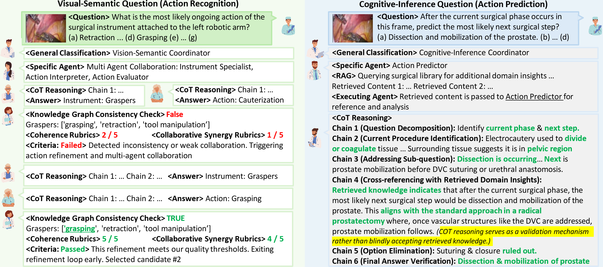
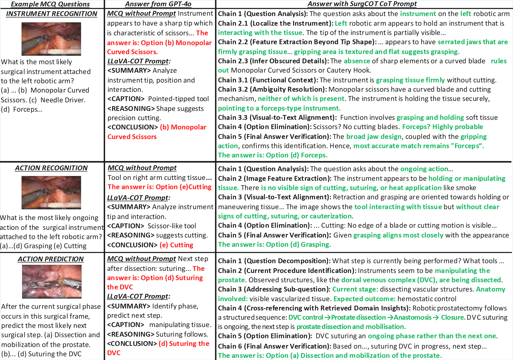

# **[IEEE Robotics and Automation Letters 2026] SurgRAW: Multi-Agent Workflow with Chain-of-Thought Reasoning for Robotic Surgical Video Analysis**

_Chang Han Low, Ziyue Wang, Tianyi Zhang, Zhuo Zhu, Zhitao Zeng, Evangelos B. Mazomenos, Yueming Jin_

[]
[]

📄 **Published in IEEE Robotics and Automation Letters (2026)**  
🔗 Early Access: https://ieeexplore.ieee.org/document/11397309  
📌 DOI: 10.1109/LRA.2026.3665443  

---

## 🏆 News

- 🎉 Accepted to *IEEE Robotics and Automation Letters (RA-L), 2026*
- 📖 Early Access version available on IEEE Xplore
- 🧠 SurgCoTBench dataset release coming soon
- 
---

## 🔍 Overview

  

SurgRAW employs **specialized prompts** and a **hierarchical orchestration system** across **five core surgical intelligence tasks**:

1. **Instrument Recognition**
2. **Action Recognition**
3. **Action Prediction**
4. **Patient Data Extraction**
5. **Outcome Assessment**

### Key Features
- **Chain-of-Thought Agents** – Task-specific prompts guide VLM agents through structured reasoning, reducing hallucinations and improving explainability.  
- **Hierarchical Orchestration** – A Department Coordinator routes queries to visual-semantic or cognitive-inference agents, mirroring real surgical workflows.  
- **Panel Discussion** – An Action Evaluator cross-checks visual-semantic predictions using a knowledge graph and rubric-based evaluation for logical consistency.  
- **Retrieval-Augmented Generation (RAG)** – Cognitive-inference tasks are grounded in external medical knowledge for reliable, domain-specific responses.

 
---

## 📊 SurgCoTBench Dataset

We evaluate SurgRAW on **SurgCoTBench** — the first reasoning-based dataset covering the entire surgical workflow.

- **12 robotic procedures**
- **2,277 frames**
- **14,176 vision–query pairs**
- **5 task categories** aligned with the SurgRAW framework

**Release Plan:** SurgCoTBench and the corresponding Chain-of-Thought prompts will be made available with our paper.  
You may also use SurgCoTBench or any dataset that includes the following columns in its `.xlsx` file:

- `image_path`
- `question`
- `ground_truth`

---

## 📌 Current Status

This repository currently showcases:
- The **SurgRAW agentic framework** architecture  
- **Collaboration metrics**  

Dataset and full CoT prompt releases will follow publication. Collaborations are warmly welcomed.

---

## ⚙️ Setting Up the Environment

Follow these steps to set up the `SurgRAW` environment:

```bash
# 1️⃣ Create a new conda environment
conda create -n SurgRAW python=3.12 -y

# 2️⃣ Activate the environment
conda activate SurgRAW

# 3️⃣ Install required Python packages
pip install -r requirements.txt
```
---
> Ensure `requirements.txt` is in the project root.  
> For GPU, install the CUDA-matching PyTorch wheels per the official PyTorch instructions.

---

## 🚀 Running SurgRAW

Run the orchestration pipeline on your `.xlsx` dataset using the provided script (which calls `final_orchestrator` under the hood).

```bash
python run_orchestration.py   --xlsx_file /path/to/your/input.xlsx   --log_dir /path/to/save/logs
```

**Arguments**
- `--xlsx_file` – Path to the Excel file with columns: `image_path`, `COT_Process`, `question_mcq`, `ground_truth` *(optional)*  
- `--log_dir` – Directory where per-row logs (`*.txt`) will be written

**Example**
```bash
python run_orchestration.py   --xlsx_file data/SurgCoTBench_sample.xlsx   --log_dir logs/
```

Each row produces a dedicated log file named like:
```
<image_name>_<COT_FileNamingConvention>_SurgCOT.txt
```

---

## 🖼 Case Studies 


---

## 📚 Citation

If you find this work useful, please cite our paper:

```bibtex
@article{low2025surgraw,
  title={Surgraw: Multi-agent workflow with chain-of-thought reasoning for surgical intelligence},
  author={Low, Chang Han and Wang, Ziyue and Zhang, Tianyi and Zeng, Zhitao and Zhuo, Zhu and Mazomenos, Evangelos B and Jin, Yueming},
  journal={arXiv preprint arXiv:2503.10265},
  year={2025}
}
```
Have fun with our work!
